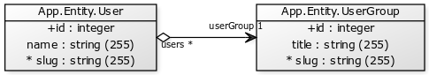

# NFQ Users & User Groups Task

Run these commands in the project's root directory:

```
# Create and populate the database
php bin/console doctrine:database:create
php bin/console make:migration
php bin/console doctrine:migrations:migrate

# Start the Symfony server
php bin/console server:start
```

### Front-end version

To use front-end version of the task go to [http://localhost:8000](http://localhost:8000), assuming the `8000` port is free.
There You will be greeted with a fairly simple management system to manage users and user groups.


### API version

*For the testing to be easy, I've decided that using **GET** params will be quicker, however of course in production such requests should not be so open, so **GET** here is only for testing purposes only.*

* GET `/api/user/list` - List all users.
* GET `/api/user/add` - Add a user with parameters: `[name:string, userGroup:int]`.
* GET `/api/user/edit` - Edit an existing user with parameters: `id:int,[name:string, userGroup:int]`.
* GET `/api/user/delete` - Delete an existing user with paremeter: `id:int`.
* GET `/api/user/group/list` - List all user groups.
* GET `/api/user/group/add` - Add a user group with parameters: `title:string`.
* GET `/api/user/group/edit` - Edit an existing user group with parameters: `id:int,[title:string]`.
* GET `/api/user/group/delete` - Delete an existing user group with parameter: `id:int`.

### Diagrams

I used the [doctrine-yuml-bundle](https://github.com/Nono1971/doctrine-yuml-bundle) bundle to draw the simple diagram that was requested to include.
It Looks like this:


